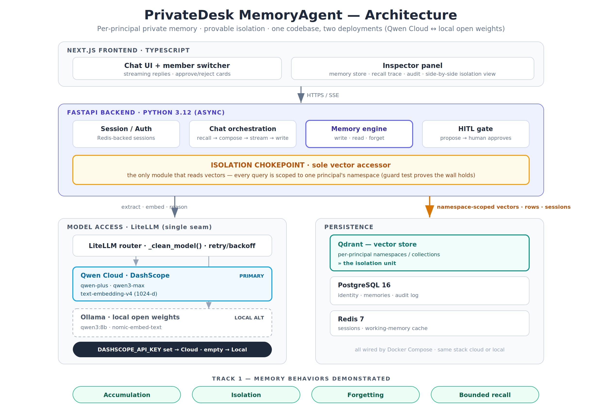

# PrivateDesk MemoryAgent

**Behavior evals: 100/100** — accumulation · isolation · forgetting · bounded recall · HITL (see [`evals/`](evals/))

**A per-principal private memory layer for AI agents — where every principal gets its own
persistent, isolated memory, and the wall between them is provable, not promised.**

The demo ships **two built-in domains** on the *identical* engine — pick either at the login
screen:

| Domain | Each principal is a… | The wall is… | The confidential "needle" fact |
|---|---|---|---|
| ⚖️ **Legal** | **matter** (case) | the profession's **ethical wall** | Acme's **$4.2M** settlement ceiling |
| 🏥 **Healthcare** | **patient** | **patient confidentiality** (HIPAA-style) | a patient's **HIV status** + medication |

Same isolation chokepoint, same governance, same memory engine — swapping domains is **data, not
code**. And it generalizes further: any principal — a SaaS tenant, a client, an individual user,
or an autonomous agent — gets a private memory no one else can reach.

Built for the **Qwen Cloud Global AI Hackathon, Track 1 (MemoryAgent)**. The exact same code
runs on **Qwen Cloud (DashScope)** *or* fully local on **open-weight Qwen3 via Ollama** — because
privacy isn't about *where the bytes live*. It's three things: **isolation, open weights, and
never training on your data.** Qwen makes all three possible.

> **Live demo:** http://47.236.30.110:3000 · **Health:** http://47.236.30.110:8000/health
> (deployed on Alibaba Cloud ECS, Singapore — see [`docs/SUBMISSION.md`](docs/SUBMISSION.md))

---

## Architecture at a glance



```
Browser ──HTTP/SSE──> Next.js cockpit ──> FastAPI backend
                                            ├─ memory engine        (write / recall / forget)
                                            ├─ isolation chokepoint ──> Qdrant   (one namespace per principal)
                                            ├─ LiteLLM  ──> Qwen Cloud (DashScope)  [CLOUD]
                                            │            └─> Ollama / open-weight Qwen3  [LOCAL]
                                            ├─ PostgreSQL  (identity, memories, audit, actions)
                                            └─ Redis       (session / ephemeral state)
```

The single seam that swaps cloud ⇄ local is the presence of `DASHSCOPE_API_KEY`. **Nothing else
in the code branches on it.** Deep dive: [`docs/TECHNICAL-ARCHITECTURE.md`](docs/TECHNICAL-ARCHITECTURE.md).

---

## What is PrivateDesk?

Most "AI memory" is a shared vector index with a tenant column bolted on — one bug, one missing
filter, and one customer's memory surfaces in another's answer. PrivateDesk inverts that: **memory
is partitioned by an opaque, server-minted namespace, and every read flows through a single
chokepoint that is *always* scoped to one namespace.** There is no code path that reads memory
without a namespace — that's the whole security property, and it's covered by a guard test.

On top of that partition sits a real **memory engine**:

- **Accumulation** — facts told to a principal are distilled into durable memories and recalled,
  unprompted, in later sessions (persisted in PostgreSQL + Qdrant, not just chat scrollback).
- **Isolation** — one principal's assistant physically cannot read another's memory. Attempts are
  logged as `isolation_block` and proven by an automated test.
- **Forgetting** — superseding facts auto-retire the old ones; an expiry + low-salience sweep
  prunes stale memory on demand.
- **Bounded recall** — with 100+ memories on one principal, a similarity + salience + recency
  reranker injects only the top ~6 into the prompt, under a token budget.
- **Human-in-the-loop** — the agent *drafts* actions; a human approves before anything is "done."

**Why it's powerful:** it's a memory *substrate*, not a single-industry app. The demo proves this
by shipping **two domains** — **legal matters** and **healthcare patients** — you switch between at
the login screen, running on the *identical* engine, chokepoint, and governance surface. The same
wall that is a law firm's *ethical wall* is a clinic's *patient confidentiality*. Point it at any
set of principals — a bank's clients, a B2B SaaS's tenants, a fleet of agents — and each gets a
private memory no one else can reach. Swapping domains is **data, not code**.

---

## How PrivateDesk achieves privacy

Four pillars, each enforced in code (not just prompts):

| Pillar | How |
|---|---|
| **1. Hard isolation** | Every principal has an opaque namespace (`ns_` + 128 bits, carries no PII). The **only** module that reads vectors ([`qdrant_client.py`](api/app/memory/qdrant_client.py)) always scopes to one namespace — collection-per-principal **and** a payload filter **and** a post-query `ISOLATION BREACH` assertion. Defense in depth. |
| **2. Open weights** | The same code runs on open-weight **Qwen3** with **zero** external calls — the model, the vectors, the database all inside your boundary. Privacy that doesn't depend on trusting a vendor. |
| **3. Never trained on** | Memories live in *your* Postgres/Qdrant. Nothing is sent for training. On the cloud path, inference uses DashScope's API (no training on inputs); on the local path, nothing leaves the box at all. |
| **4. Data minimization** | Namespaces are opaque tokens generated server-side and never client-supplied, so they can't be spoofed and leak nothing if inspected. Human-readable labels are stored separately from the isolation key. |

**Server-side namespace resolution** means a client never chooses whose memory it reads — the
backend derives it from the authenticated principal record on every request.

---

## How governance is achieved

PrivateDesk is built for regulated, auditable use — the memory layer *is* the compliance surface:

- **Append-only audit trail** — every `memory_write`, `memory_recall`, `isolation_block`,
  `memory_maintenance`, and `hitl_approved|rejected` is recorded with structured detail
  ([`audit.py`](api/app/audit.py)) and shown live in the inspector's Audit tab.
- **Isolation attestation** — [`tests/test_isolation.py`](api/tests/test_isolation.py) is an
  exportable proof the wall holds across 100+ memories; run it in CI as a continuous control.
- **Human-in-the-loop gate** — agents propose actions (reminders, drafts, calendar events); a
  human approves before execution. Proposals and decisions are audited. Nothing auto-fires.
- **Right-to-be-forgotten & retention** — supersession + expiry + salience pruning retire stale
  memory; `delete_namespace()` wipes a principal's vectors wholesale.
- **Data residency & sovereignty** — self-host in your own VPC (one-command Alibaba Cloud IaC),
  or run fully offline on open weights. You choose where inference and data live per your
  compliance posture — without changing a line of code.
- **Explainable recall** — every answer ships a **recall trace** (candidates → selected, with
  per-memory similarity/salience/score and a token count), so you can see exactly which memories
  informed a response.

---

## Where it runs — three environments, one codebase

The `DASHSCOPE_API_KEY` seam ([`config.py`](api/app/config.py)) is the only thing that changes.

| Environment | LLM + embeddings | When | Data leaves your box? |
|---|---|---|---|
| **Local — open weights** | Ollama: `qwen3:8b` / `qwen3:32b` / `nomic-embed-text` (768-d) | Air-gapped, max privacy, dev | **No** — fully offline |
| **Cloud — Qwen Cloud** | DashScope: `qwen-plus` / `qwen3-max` / `text-embedding-v4` (1024-d) | Best quality, managed inference | Inference only (no training) |
| **Self-hosted cloud — Alibaba Cloud ECS** | Either of the above, in **your** VPC | Production / demo, data residency | Stays in your tenancy |

```
DASHSCOPE_API_KEY set    →  Qwen Cloud (DashScope)
DASHSCOPE_API_KEY empty  →  local Ollama / open-weight Qwen3
```

---

## Quickstart

### Cloud path (Qwen Cloud / DashScope)
```bash
cp .env.example .env            # set DASHSCOPE_API_KEY=sk-...  (Alibaba Cloud Model Studio; Free Quota is fine)
make dev                        # build, wait for /health, seed the demo
# open http://localhost:3000 → sign in; pick Legal or Healthcare at the login screen
# health: http://localhost:8000/health  (expect "llm_ok": true)
```

### Local path (Ollama, open weights — no code changes)
```bash
ollama serve
ollama pull qwen3:8b && ollama pull nomic-embed-text
# in .env: leave DASHSCOPE_API_KEY empty (the LOCAL_* block is used automatically)
docker compose up --build
curl localhost:8000/health      # -> {"provider":"Local (Ollama)", ...}
```

### Full cloud deploy (Alibaba Cloud, one command)
Infrastructure-as-Code stands up VPC + security group + ECS + EIP, ships the code, and seeds the
demo — nothing to click. See [`infra/terraform/`](infra/terraform/) and [`DEPLOY.md`](DEPLOY.md).
```bash
export ALICLOUD_ACCESS_KEY=…  ALICLOUD_SECRET_KEY=…  TF_VAR_dashscope_api_key=sk-…
make infra-up                   # terraform apply → prints the live app_url / health_url
make infra-down                 # tear it all down
```

**Walkthrough for a demo:** [`docs/DEMO-WALKTHROUGH.md`](docs/DEMO-WALKTHROUGH.md).

---

## The isolation guarantee (and how to verify it)

Every vector read goes through **one** function — [`qdrant_client.py`](api/app/memory/qdrant_client.py)
`search()` — which always scopes to a single principal's namespace. No other module touches
Qdrant. The guard test proves the wall holds across 100+ seeded memories:

```bash
# with the stack up and a provider reachable:
docker compose exec api pytest -q tests/test_isolation.py     # -> 1 passed
```

A query in one principal's memory never returns another's. Exported, this test is the
**isolation attestation** — the artifact a security review can rely on.

## Behavior evals — the four behaviors, quantified

Beyond the pass/fail guard test, [`evals/run_evals.py`](evals/run_evals.py) scores every behavior
end to end over the API and writes a [scorecard](evals/REPORT.md). It reseeds a known state,
probes recall traces and answers, and **exits non-zero on any isolation leak** — so it gates CI.

```bash
EVAL_API_BASE=http://<host>:8000 python3 evals/run_evals.py
```

| Accumulation | Isolation 🔒 | Bounded recall | Forgetting | Human-in-the-loop |
|:---:|:---:|:---:|:---:|:---:|
| 100 | 100 | 100 | 100 | 100 |

Run them against any deployment; the harness reseeds a known state and exits non-zero on any
isolation leak. See [`evals/README.md`](evals/README.md).

---

## Key endpoints

| Endpoint | Purpose |
|---|---|
| `POST /api/session/start` | begin a session for a principal |
| `POST /api/chat` | SSE chat: recall → compose → stream → async memory write → HITL detect |
| `GET /api/members` | principal list (matters or patients, per the loaded domain) |
| `GET /api/inspector/memories` | a principal's memory store (status + salience) |
| `GET /api/inspector/audit` | audit log incl. `isolation_block` events |
| `POST /api/inspector/maintenance` | run the forgetting sweep live |
| `GET /api/actions/pending` · `POST /api/actions/{id}/approve\|reject` | human-in-the-loop |
| `POST /api/demo/seed` | seed personas + 100+ memories (self-healing) |
| `GET /health` | one real completion + one real embedding — proves the provider is live |

---

## Repo layout & docs

```
api/app/    FastAPI backend — memory engine, isolation chokepoint, LLM seam, routers
web/        Next.js 14 cockpit — chat, inspector, ethical-wall view
infra/      Terraform IaC for Alibaba Cloud (VPC · ECS · EIP · security group)
docs/       architecture diagram + deep-dive docs (below)
```

| Doc | What |
|---|---|
| [`docs/TECHNICAL-ARCHITECTURE.md`](docs/TECHNICAL-ARCHITECTURE.md) | How every component works, the isolation model, the request lifecycle |
| [`docs/DEMO-WALKTHROUGH.md`](docs/DEMO-WALKTHROUGH.md) | Click-by-click demo of all five behaviors (login-first flow) |
| [`docs/TEST-CASES.md`](docs/TEST-CASES.md) | Full test plan — automated (`make smoke` / `make evals` / pytest) + manual UI cases |
| [`docs/FUNCTIONAL-TEST-CASES.md`](docs/FUNCTIONAL-TEST-CASES.md) | Plain-English UAT for business users — no jargon, click-by-click, with a results sheet |
| [`docs/SUBMISSION.md`](docs/SUBMISSION.md) | Hackathon submission packet |
| [`DEPLOY.md`](DEPLOY.md) | Local + Alibaba Cloud deployment |

---

## Honest state (no overclaiming)

- **Login is a *dummy* login** (no passwords) — but it's real, server-side auth: a signed token
  binds a session to one principal, and the API returns **403** for any other principal (and
  metadata-only for the supervisor role). Swapping in real passwordless/SSO is a drop-in on top.
- **Lean topology:** one principal = one namespace. Team access to a shared principal and a
  client-facing view are extensions on top of the same engine.
- DB schema uses `create_all` for hackathon speed (swap for Alembic in prod); CORS is open for the
  demo (lock down for prod); Redis is provisioned for scale-out (sessions currently persist in PG).

The full PrivateDesk product (dashboard, email/finance/travel modules, federation, billing,
multi-tenant SSO) is deliberately out of scope here. **This repo is the memory engine and the
proof.**

## License

MIT — see [`LICENSE`](LICENSE).
